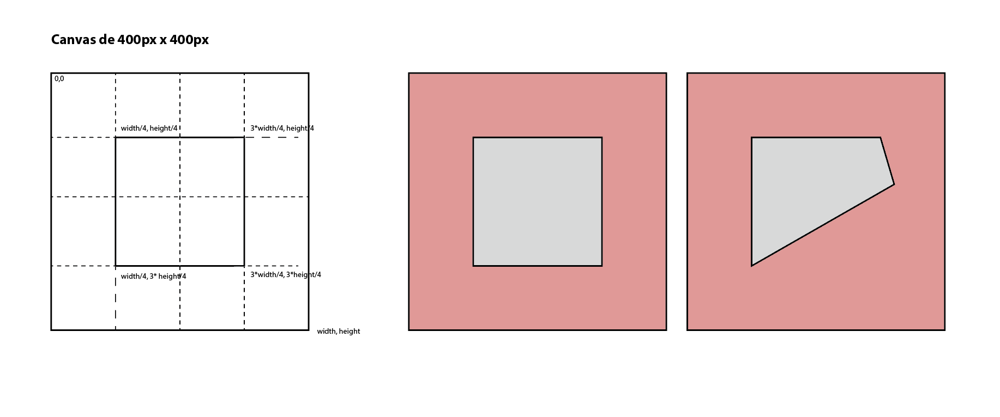
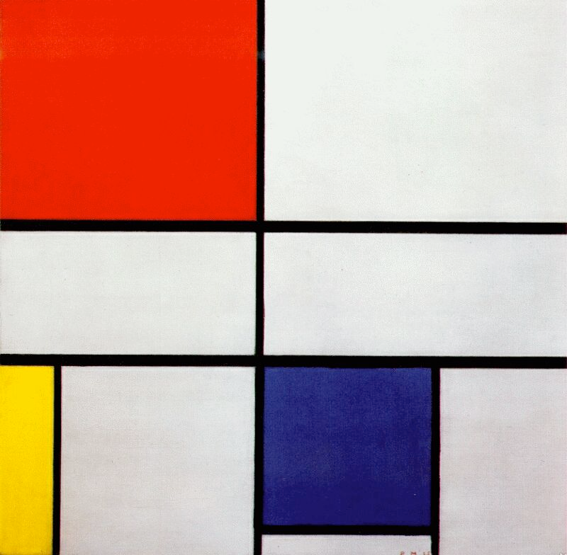

# Aula 2 — Código Criativo II

!!! tip "Configuração Base"
    Se ainda não configuraste o ambiente de trabalho, consulta o guia de [Configuração Base P5JS](../../Recursos/CodigoCriativocomP5JS.md).

## Data

**2 de outubro de 2026** (6ª feira)

## Sumário

- Revisão dos conceitos da aula anterior (`setup`/`draw`, formas primitivas, interatividade)
- Ciclo `for` — repetição e padrões
- Lançamento do **Ex01 — Mondrian**
- Referências: [The Coding Train](https://thecodingtrain.com/)

---

## Exemplos em aula

### Revisão — "Hello World" em P5.js

```js
function setup() {
  createCanvas(windowWidth, windowHeight);
}

function draw() {
  fill(100, 80, 150);
  circle(mouseX, mouseY, random(50, 100));
}
```

### Interatividade — Quad com `mouseX` / `mouseY`



```js
function setup() {
  createCanvas(400, 400);
  background(234, 148, 139);
}

function draw() {
  background(234, 148, 139);
  fill(216, 216, 216);
  stroke(0);
  strokeWeight(2);
  quad(width/4, height/4, 3*width/4, height/4, mouseX, mouseY, width/4, 3*height/4);
}
```

### Desenho 2D — formas e cor

```js
function setup() {
  createCanvas(windowWidth, windowHeight);
}

function draw() {
  fill(200, 180, 40);
  stroke(40, 180, 200);
  strokeWeight(5);
  circle(width/2, height/2, 200);
  strokeWeight(10);
  line(width/2, 0, width/2, height);
}
```

### Ciclo `for` — grelha interativa

Neste exemplo o `map()` converte a posição do rato no número de divisões da grelha — mover o rato altera a densidade de linhas em tempo real.

```js
let valorY, valorX;

function setup() {
  createCanvas(windowWidth, windowHeight);
  background(0);
  stroke(255);
  strokeWeight(2);
  valorY = 0;
  valorX = 0;
}

function draw() {
  background(0);
  valorY = map(mouseY, 0, height, 30, 4);
  valorX = map(mouseX, 0, width, 30, 4);

  for (let i = 1; i < valorY; i++) {
    line(0, (i * height) / valorY, width, (i * height) / valorY);
  }

  for (let j = 1; j < valorX; j++) {
    line((j * width) / valorX, 0, (j * width) / valorX, height);
  }
}

function windowResized() {
  resizeCanvas(windowWidth, windowHeight);
}
```

### Ciclo `for` — grelha de círculos

Dois ciclos `for` encadeados criam uma matriz de círculos — a base para muitos padrões generativos.

```js
let valor;

function setup() {
  createCanvas(windowWidth, windowHeight);
  background(0);
  stroke(255);
  noFill();
  strokeWeight(2);
  valor = 20;
}

function draw() {
  background(0);
  for (let i = 1; i < valor; i++) {
    for (let j = 1; j < valor; j++) {
      circle(i * (width / valor), j * (height / valor), 15);
    }
  }
}

function windowResized() {
  resizeCanvas(windowWidth, windowHeight);
}
```

### Experiência livre — splines aleatórias

Exemplo de composição cumulativa: curvas spline com posição, rotação e escala aleatórias que se acumulam frame a frame.

```js
function setup() {
  createCanvas(windowWidth, windowHeight);
  background(0);
  noFill();
  angleMode(DEGREES);
  stroke(255);
  strokeWeight(1);
}

function draw() {
  push();
  translate(random(0, width), random(0, height));
  rotate(random(360));
  scale(random(0.1 * random(1, 5)));
  spline(
    0, 0,
    random(350, 400), random(150, 250),
    random(500, 600), random(400, 500),
    180, 300,
  );
  pop();
}

function windowResized() {
  resizeCanvas(windowWidth, windowHeight);
}
```

---

## Ex01 — Mondrian



### Enunciado

Partindo da obra *Composição nº III* de Piet Mondrian, este exercício pede dois sketches P5.js que exploram a tensão entre rigor compositivo e acaso generativo.

!!! info "Prazo e ferramenta"
    **Entrega via Moodle até à Aula 5 (23 de outubro).** Na Aula 3 (9 de outubro) podes mostrar o que tens para comentário em aula.

    Trabalha em **p5.js no VSCode**, a partir do template base de p5.js (ver [Código Criativo com P5.js](../../Recursos/CodigoCriativocomP5JS.md)).

#### Parte A — Reprodução fiel

Reproduzir em código, com o maior rigor possível, a composição original:

- **Proporções** — o canvas deve respeitar a proporção do quadro, com largura mínima de 800 px. O quadro não é um quadrado perfeito: importa a imagem de referência para um programa vetorial (Illustrator ou Inkscape), mede as proporções e a posição das linhas, e traduz depois essas medidas para código
- **Cores** — utilizar as cores exactas da obra (branco, vermelho, azul, amarelo, preto)
- **Formas e linhas** — replicar a espessura e posição das linhas pretas que delimitam os blocos de cor
- **Texturas** — observar e tentar reproduzir subtilezas da superfície pintada (irregularidades, variação tonal)

#### Parte B — Desestabilização

A partir do sketch da Parte A, introduzir **um único elemento generativo** que desestabilize a composição — uma subtileza provocadora que ponha em causa a ordem rígida de Mondrian. Pode ser:

- Uma cor que oscila imperceptivelmente
- Uma linha que treme
- Um bloco que se desloca lentamente
- Um ruído que corrompe a geometria perfeita

O `random()` deve ser usado de forma **contida e intencional** — não se trata de destruir a composição, mas de lhe injectar vida.

### Entrega

Via **Moodle**, até à Aula 5 (23 de outubro), submeter **estes seis ficheiros** — sketch, captura e reflexão de cada parte:

| Ficheiro                                                    | Descrição                                                 |
| ----------------------------------------------------------- | --------------------------------------------------------- |
| Repositório github Parte A - link                           | explo: 'https://github.com/steam228/Ex01-floresNoQuintal' |
| Repositório github Parte A - link para página (githubpages) | explo: 'https://hacktoimprove.com/Ex01-floresNoQuintal/'  |
| Repositório github Parte B - link                           | idem                                                      |
| Repositório github Parte B - link para página (githubpages) | idem                                                      |
| readme.md - repo Parte A                                    | Breve descrição das decisões tomadas na reprodução        |
| readme.md - repo Parte B                                    | Descrição do elemento generativo escolhido e porquê       |

---

## Referências

- [The Coding Train](https://thecodingtrain.com/) — tutoriais de código criativo
- [The Coding Train — Conditional Statements](https://www.youtube.com/watch?v=YsGeMIpEcY4)


### Experiencia da Imagem de Capa

```javascript

function setup() {

createCanvas(windowWidth, windowHeight);

angleMode(DEGREES);

background(0);

noFill();

strokeWeight(1);

}

  

function draw() {

push();

stroke(255, random(255));

translate(random(width), random(height));

scale(0.8);

rotate(random(360));

spline(

0,

0,

random(90, 150),

random(0, 90),

random(100, 200),

random(200, 300),

200,

random(100, 400),

);

pop();

}

  

function windowResized() {

resizeCanvas(windowWidth, windowHeight);

}


```

### for + bubles

```javascript

let divs;

  
function setup() {

createCanvas(windowWidth, windowHeight);
background(0);
stroke(255);
strokeWeight(2);
frameRate(4);
}

  

function draw() {

background(0);
divs = map(mouseY, 0, height, 30, 10);

for (let i = 1; i < divs; i++) {
	for (let j = 1; j < divs; j++) {
		let rad = random(20, 60);
		noStroke();
		circle((i * width) / divs, (j * height) / divs, rad);
		stroke(70, 180);
		strokeWeight(3);
		arc((i * width) / divs,(j * height) / divs, rad * 0.65, rad * 0.65, HALF_PI, PI,);
	}
	}
}

  

function windowResized() {
resizeCanvas(windowWidth, windowHeight);
}

```

### Articulação com DPI (para começar a pensar!)

As composições geradas podem explorar as mesmas lógicas de modularidade que o (com)FORMA pede: como uma unidade se repete, roda e combina para gerar configurações distintas.
