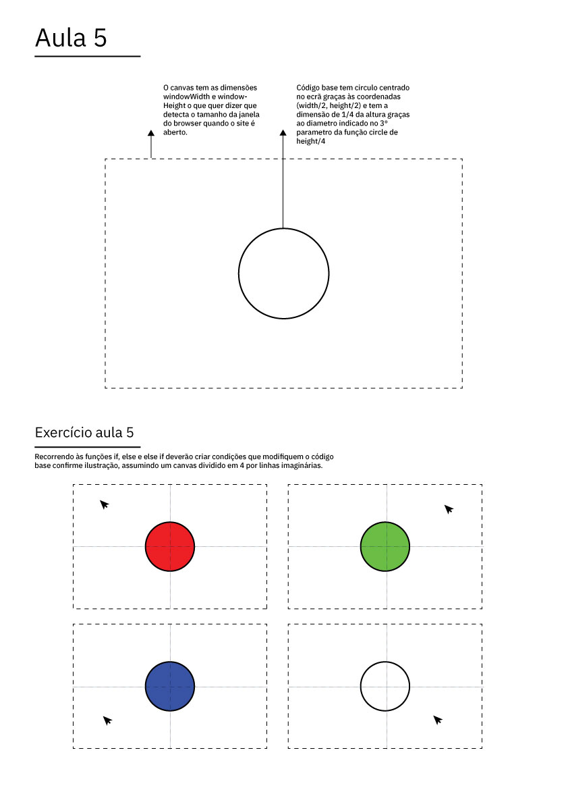
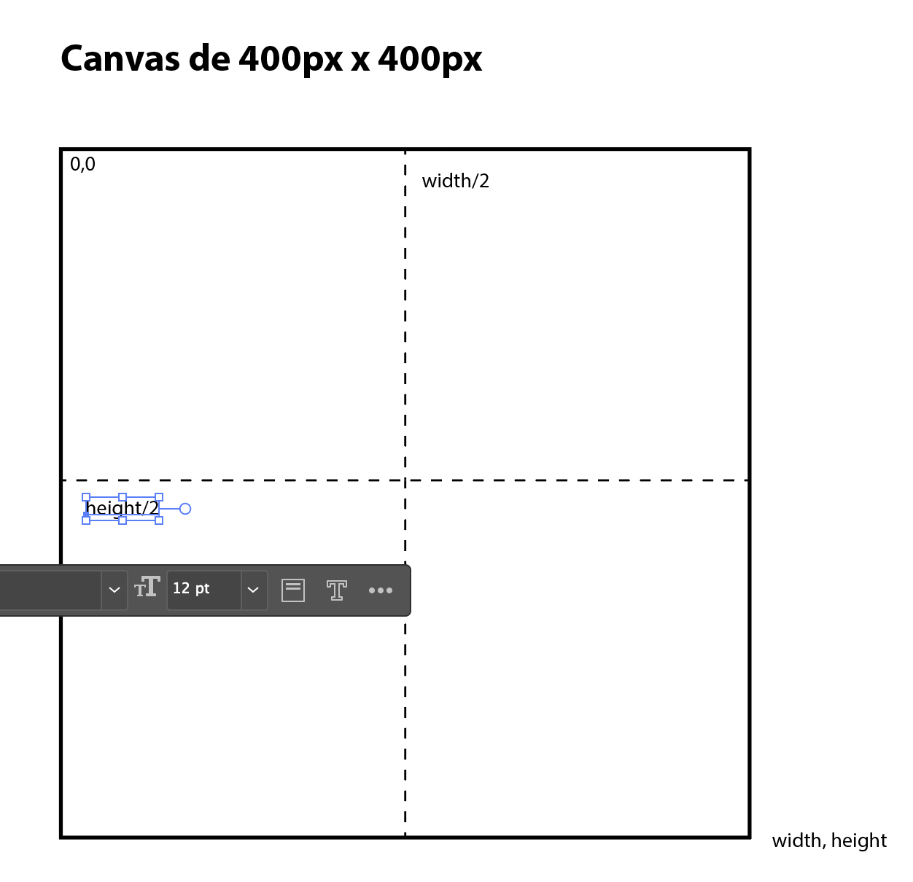

# Aula 3 — Código Criativo III

## Data

**9 de outubro de 2026** (6ª feira)

## Sumário

- Interação e animação: parâmetros que mudam com o tempo ou com o utilizador
- Exportação de resultados: imagem, vídeo, SVG
- Sessão de trabalho: finalização do exercício
- Apresentação e discussão dos resultados em aula

## Notas da Aula

### Conceitos introduzidos

### Condicionais — `if` / `else`



```js
function setup() {
  createCanvas(windowWidth, windowHeight);
  frameRate(14);
  noFill();
  stroke(0);
}

function draw() {
  background(255);

  if (mouseX < width/2) {
    if (mouseY > height/2) {
      fill(255, 0, 0);
    } else {
      fill(0, 255, 0);
    }
  } else {
    if (mouseY > height/2) {
      fill(0, 0, 255);
    } else {
      noFill();
    }
  }

  strokeWeight(random(2, 20));
  circle(width/2, height/2, height/4);
}
```

#### Variação — desenho cumulativo por quadrante



```js
function setup() {
  createCanvas(600, 600);
  background(255);
}

function draw() {
  noStroke();
  if (mouseX < width / 2) {
    if (mouseY < height / 2) {
      fill(255, 0, 0);
    } else {
      fill(0, 255, 0);
    }
  } else {
    if (mouseY < height / 2) {
      fill(0, 0, 255);
    } else {
      fill(0);
    }
  }
  circle(mouseX, mouseY, 20);
}
```


- `mouseX`, `mouseY` — interação com o rato
- `frameCount`, `sin()`, `cos()` — animação e movimento cíclico
- `save()`, `saveCanvas()` — exportar imagens
- Exportação SVG para fabricação (corte laser, vinil)

---

### Ex02 — if/else

Criar uma **composição interativa** que use condicionais (`if`/`else`) para alterar o comportamento visual com base na posição do rato, teclas pressionadas ou outros inputs.

**Objetivo:** Explorar a tomada de decisão no código — como o programa reage a diferentes condições e como isso gera variação visual.

**Requisitos:**

- Usar pelo menos **duas condições** (`if`/`else`) que alterem cores, formas ou comportamentos
- O resultado deve ser **visualmente interessante** — não basta funcionar, tem de comunicar
- Pode partir dos exemplos da aula ou criar algo de raiz

**Entrega:** `sketch_ex02.js` + `captura_ex02.png`

---

### Trabalho Final — Output Generativo para DPI

Criar um **output generativo** (imagem, padrão, forma ou animação) com potencial de aplicação no projeto de Design de Produto e Interação I ((com)FORMA).

**Objetivo:** Usar o código como ferramenta de exploração formal — gerar computacionalmente formas, padrões ou modularidades que possam informar ou enriquecer o projeto de produto.

**Possibilidades:**

- Padrões modulares que se repetem, rotam e combinam em configurações distintas
- Formas orgânicas ou geométricas geradas por algoritmos (noise, fractais, sistemas de partículas)
- Composições paramétricas onde variáveis controlam proporções, escala ou densidade
- Texturas ou grafismos gerados por código para aplicação em superfícies

**Entrega:** Ficheiro de código + imagem/vídeo do resultado + breve texto descritivo (máx. 200 palavras) explicando as decisões e a relação com o projeto de DPI.

---

### Entregas — Bloco 1

O Bloco 1 tem três exercícios:

| Exercício | Lançamento | Descrição |
|-----------|------------|-----------|
| **Ex01 — Mondrian** | [Aula 2](aula2.md) | Reprodução fiel + destabilização generativa |
| **Ex02 — if/else** | Aula 3 | Composição interativa com condicionais |
| **Trabalho Final** | Aula 3 | Output generativo com potencial para DPI |

Nesta aula mostras o que tens do Ex01 para comentário. A entrega final de todos os exercícios é via **Moodle até à Aula 5 (23 de outubro)**.
