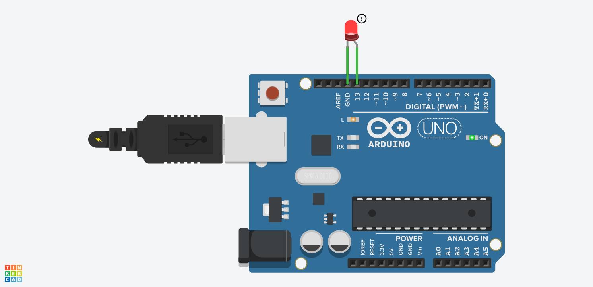
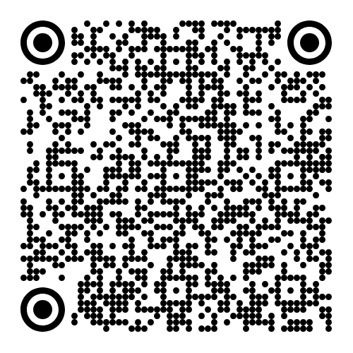

# Aula 5 — Computação Física I

## Data

**23 de outubro de 2026** (6ª feira)

## Sumário

- Introdução à computação física: do digital ao tangível
- O que é um microcontrolador? Entradas e saídas
- Instalação do [Arduino IDE](https://www.arduino.cc/en/software/#ide)
- Primeiro programa: **Blink** — o "Hello World" do Arduino
- Exercício: comunicação em Morse com LED
- Desafio: escrever uma palavra em Morse legível pelo decoder digital

## Notas da Aula

### O que é Computação Física?


*How a Computer sees you* por [Tom Igoe](https://tigoe.com/)

[ArduinoComic.pdf](../attachments/index.pdf) — introdução ilustrada ao Arduino

### Ferramentas

- **Arduino IDE** — [arduino.cc/software](https://www.arduino.cc/en/software/#ide)
- **Arduino Reference** — [arduino.cc/reference](https://www.arduino.cc/reference/en/)

### Referências de artistas

- [Neil Mendoza](https://vimeo.com/neilmendoza) — esculturas cinéticas e interativas

---

## 1. Blink — "Hello World"



```arduino
#define led 13

void setup() {
  pinMode(led, OUTPUT);
  digitalWrite(led, LOW);
}

void loop() {
  digitalWrite(led, HIGH);
  delay(500);
  digitalWrite(led, LOW);
  delay(500);
}
```

---

## 2. Morse Blink

[Creative Coding Classes](https://steam228.github.io/CreativeCodingClasses2025/) — projetos de referência

### Decoder e Encoder digitais de Morse



**MORSE DECODER**: <https://steam228.github.io/CreativeCodingClasses2025/morseBlink/p5js/decoder/index.html>

.png)

**MORSE ENCODER**: <https://steam228.github.io/CreativeCodingClasses2025/morseBlink/p5js/encoder/index.html>

### SOS — Exemplo simples

```arduino
#define batatas 13

void setup() {
  pinMode(batatas, OUTPUT);
  digitalWrite(batatas, LOW);
}

void loop() {
  // S (...)
  digitalWrite(batatas, HIGH); delay(200);
  digitalWrite(batatas, LOW);  delay(200);
  digitalWrite(batatas, HIGH); delay(200);
  digitalWrite(batatas, LOW);  delay(200);
  digitalWrite(batatas, HIGH); delay(200);
  digitalWrite(batatas, LOW);  delay(400);

  // O (---)
  digitalWrite(batatas, HIGH); delay(800);
  digitalWrite(batatas, LOW);  delay(300);
  digitalWrite(batatas, HIGH); delay(800);
  digitalWrite(batatas, LOW);  delay(300);
  digitalWrite(batatas, HIGH); delay(800);
  digitalWrite(batatas, LOW);  delay(400);

  // S (...)
  digitalWrite(batatas, HIGH); delay(200);
  digitalWrite(batatas, LOW);  delay(200);
  digitalWrite(batatas, HIGH); delay(200);
  digitalWrite(batatas, LOW);  delay(200);
  digitalWrite(batatas, HIGH); delay(200);
  digitalWrite(batatas, LOW);  delay(1000);
}
```

### SOS — Versão com variáveis e ciclos

```arduino
#define coisa 13

int longTime = 800;
int shortTime = 200;
int intervalTime = 200;
int interval = 0;
int counter = 1;

void setup() {
  Serial.begin(9600);
  pinMode(coisa, OUTPUT);
  digitalWrite(coisa, LOW);
}

void loop() {
  if (counter == 1 || counter == 3) {
    interval = shortTime;
    for (int j = 0; j < 3; j++) {
      digitalWrite(coisa, HIGH);
      delay(interval);
      digitalWrite(coisa, LOW);
      delay(intervalTime);
    }
    counter++;
  }
  else if (counter == 2) {
    interval = longTime;
    for (int i = 0; i < 3; i++) {
      digitalWrite(coisa, HIGH);
      delay(interval);
      digitalWrite(coisa, LOW);
      delay(intervalTime);
    }
    counter++;
  }
  else {
    delay(2000);
    counter = 1;
  }
  Serial.println(counter);
}
```

### Temporização Morse — referência

```
DOT_DURATION    = 200ms
DASH_DURATION   = 800ms
SYMBOL_GAP_DOT  = 200ms   // intervalo após ponto
SYMBOL_GAP_DASH = 300ms   // intervalo após traço
LETTER_GAP      = 400ms   // intervalo entre letras
WORD_GAP        = 1000ms  // intervalo entre palavras
```

### Desafio

Escrevam uma palavra no Arduino que o **DECODER digital** consiga ler ao apontar a câmara para o LED a piscar.
