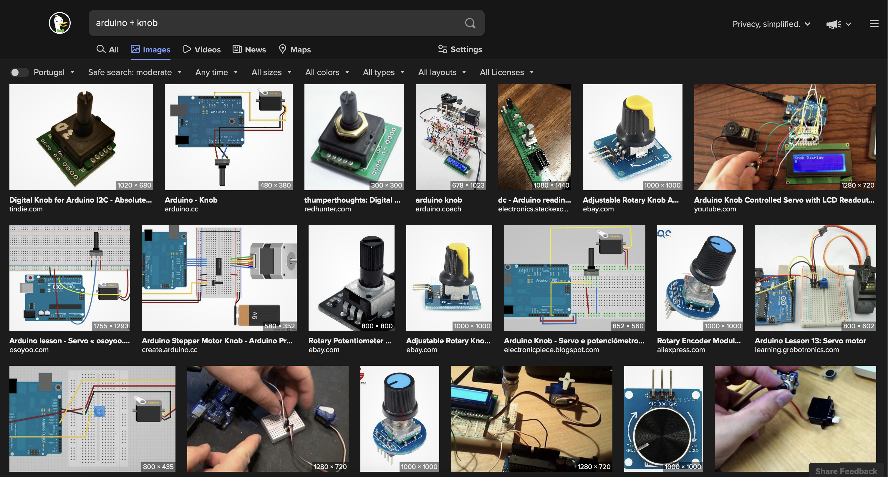
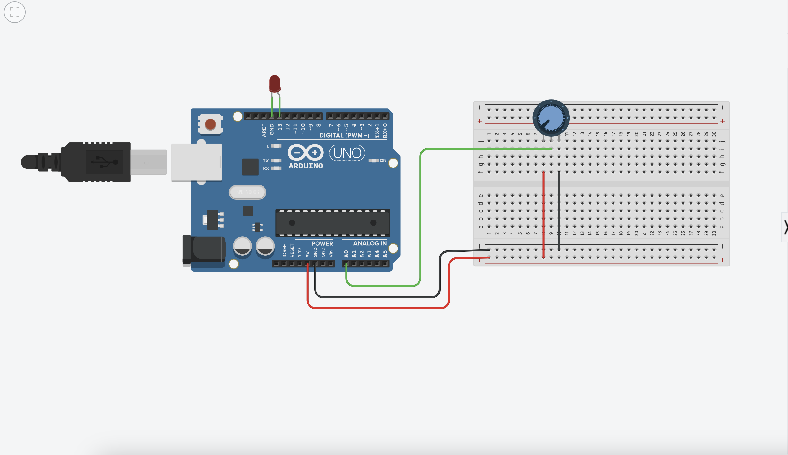
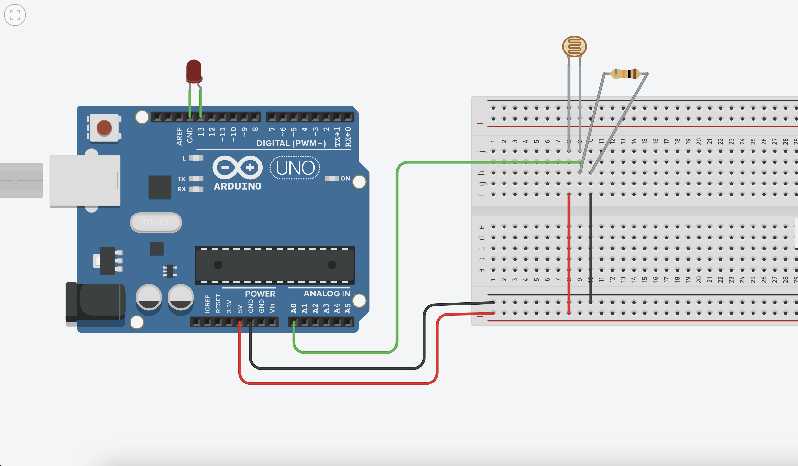
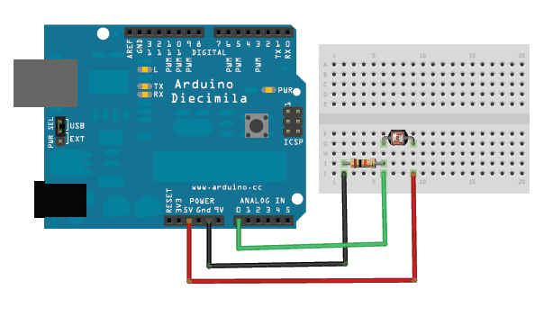

# Aula 6 — Computação Física II

## Data

**30 de outubro de 2026** (6ª feira)

## Sumário

- Conversão Analógico-Digital (ADC) — leitura de sensores analógicos
- Comunicação pela porta série (`Serial`)
- Potenciómetro: leitura e mapeamento de valores
- LDR (sensor de luz): leitura e tomada de decisão
- Introdução ao conceito de protótipo de interação

## Notas da Aula

### Analog to Digital — ADC + Comunicação Porta Série



### Potenciómetro

```arduino
#define ledPin 13

int sensorValue = 0;
int angulo = 0;

void setup() {
  Serial.begin(9600);
  pinMode(ledPin, OUTPUT);
  digitalWrite(ledPin, LOW);
}

void loop() {
  sensorValue = analogRead(A0);
  angulo = map(sensorValue, 0, 1023, 0, 360);
  if (angulo >= 180) {
    digitalWrite(ledPin, HIGH);
  } else {
    digitalWrite(ledPin, LOW);
  }

  Serial.println(angulo);
  delay(1);
}
```



### LDR — Sensor de Luz

Referências:

- [How to use an LDR with Arduino](https://maker.pro/arduino/tutorial/how-to-use-an-ldr-sensor-with-arduino)
- [Photocells — Adafruit](https://learn.adafruit.com/photocells/connecting-a-photocell)



Versão simples — ler o sensor e acender LED quando escurece:



```arduino
#define sensLuz A0
#define ledPin 13

int valorSensLuz = 0;
int asEscuras = 200;

void setup() {
  Serial.begin(9600);
  pinMode(ledPin, OUTPUT);
  digitalWrite(ledPin, LOW);
}

void loop() {
  valorSensLuz = analogRead(sensLuz);
  Serial.println(valorSensLuz);
  if (valorSensLuz < asEscuras) {
    digitalWrite(ledPin, HIGH);
  } else {
    digitalWrite(ledPin, LOW);
  }
  delay(1);
}
```

### Conceitos-chave

- `analogRead()` — leitura de valor analógico (0–1023)
- `map()` — traduzir um intervalo de sensor para um intervalo de atuador
- `Serial.println()` — comunicação com o computador pela porta série
- Divisor de tensão — princípio base dos sensores resistivos (LDR, termístor, FSR)

### Articulação com DPI

Pensar como os módulos do (com)FORMA poderiam incorporar eletrónica simples: um módulo com LED, um módulo sensível ao toque, um módulo que reage à luz.
