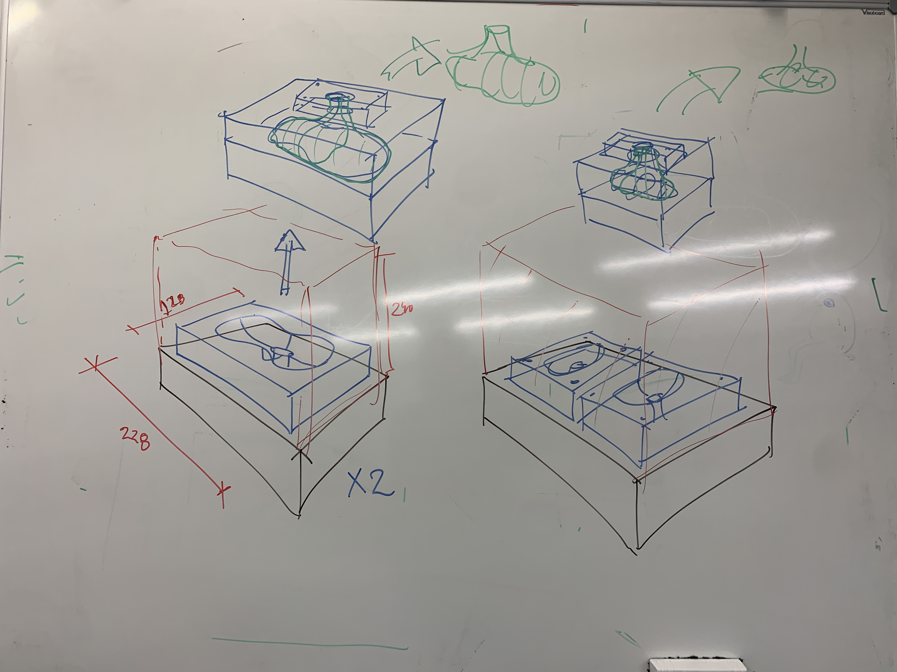

# Aula 3 — Moldes Digitais II

## Data

**6 de outubro de 2026** (3ª feira)

## Sumário

- **Apresentação dos estudos por esboço** — feedback oral individual sobre os desenhos do objeto pessoal e do objeto de referência (exercício da Aula 2)
- Tipos de molde: aberto, bipartido, perdido
- Demonstração em Fusion 360: modelação digital de peças e moldes hipotéticos (gravação de ecrã disponibilizada posteriormente)
- Vídeos de processos analógicos de moldagem
- Exemplos de integração de formas existentes em novos moldes
- Técnicas de integração: como incorporar um fragmento do objeto original na geometria do molde
- Operações booleanas e projeção de superfícies
  

## Notas da Aula

### Apresentação dos estudos por esboço

Cada estudante apresenta os seus estudos em esboço (até 3 A3 por objeto) referentes ao objeto pessoal e ao objeto de referência. Feedback oral do professor sobre a qualidade da observação, o rigor do desenho estrutural e as oportunidades formais identificadas.

Após o feedback, os estudantes poderão refinar os esboços e entregar a versão final via **Moodle até à Aula 4 (13 de outubro)**.

### Demonstração — Moldes digitais em Fusion 360

##### 001 - Intro aos Moldes

https://youtu.be/QnZggaYwW-s

Demonstração ao vivo do processo de modelação de peças e moldes hipotéticos em Fusion 360, complementada com vídeos de processos analógicos de moldagem.
Video apresenta conceitos-chave de molde, através da modelação de uma pequena cupula, e respectivo molde. A cupula seria modelada em plasticina através de molde e contra-molde a imprimir em 3D. O video demonstra este processo simples e alguns cenários de falha de modo a introduzir os conceitos infra.

### Conceitos-chave

- **Draft angle** — ângulo de desmoldagem
- **Undercuts** ou "prisões" — geometrias que impedem a desmoldagem
- **Parting line** — linha de separação do molde

## Recursos

### Guia — Molde em Resina (Fusion 360)

[Resin mould 3D Model — Fusion 360 Guide v3.0 (PDF)](../attachments/Resin_mould_3D_Model(Fusion_360_guide)_v3.0.pdf)

### Modelos 3D — Autodesk Viewer

<https://a360.co/3CxJAef>

<https://a360.co/3UO0P0X>

### Esquemas do Quadro

### Articulação com DI

Na sexta-feira anterior (aula 2 de DI), os alunos trabalharam código criativo — padrões e repetições. Discutir como essas explorações podem informar a geometria modular do projeto.
