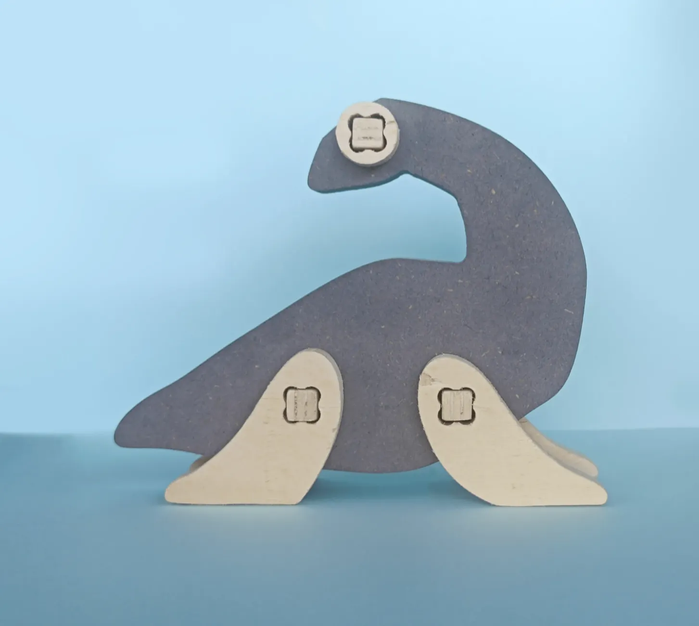

# Design de Produto - Projeto em Design III
Professor**:** [André Rocha](https://www.notion.so/Andr-Rocha-6ad5ace93db74d6580132c91d6185012?pvs=21)
Sala(s) de aula**:** 209 e Fablab
**Email:** [arocha@eselx.ipl.pt](mailto:arocha@eselx.ipl.pt)

## Programa
- Introdução ao Design conceptual, crítico e especulativo;
- Da indústria manufatureira tradicional aos Makerspaces e à Indústria 4.0 / Design Distribuído. As suas Implicações em Projecto;
- Desenhar novos produtos - os desafios e o papel do designer de produto;
- Documentação e Comunicação de um projecto (adaptação do discurso visual a diferentes contextos e suportes de apresentação);
- Processos e tecnologias de transformação da matéria - aditivos, subtrativos e conformação;
- Seleção de materiais;
- Ferramentas e equipamento de fabricação digital: metodologias, equipamento e segurança.

## Avaliação
### Ponderação
Projeto Individual (fase 1 - Produto): **70%**
Projeto em Grupo (fase 2 - Marca e Embalagem): **30%**

### Escala
**R** 0 - 9.5 **A** 9.6 - 20

### Exercícios e Projeto
Todas as entregas serão efetuadas exclusivamente via moodle, até à data estipulada para entrega. Com excepção para a a entrega do projeto final, as entregas parciais ficarão disponíveis mais 4 semanas além data limite, implicando a entrega fora de prazo uma depreciação de 1 valor por cada semana na avaliação.
### Plágio
Apresentar as ideias de outras pessoas como nossas, constitui uma grave infração das regras de produção académica pelo que não será tolerada.
### Projeto Final
O principal objeto de avaliação do módulo de Design de Produto III é o Projeto Final. É através deste que avaliamos a aplicação dos conceitos e ferramentas abordados ao longo do semestre.
### Utilização de IA
É permitida a utilização de IA em qq fase do processo de trabalho e até mesmo incentivada, desde que o seu uso seja reconhecido e citado, quer na exposição dos diferentes processos, quer como nota bibliográfica.

[Trabalho de Raquel Silva 2024-25](https://petalite-zucchini-7c0.notion.site/Dino-KIT-Projeto-NESTOR-20f79b7763f980dfbc7bc04a36fdf043)