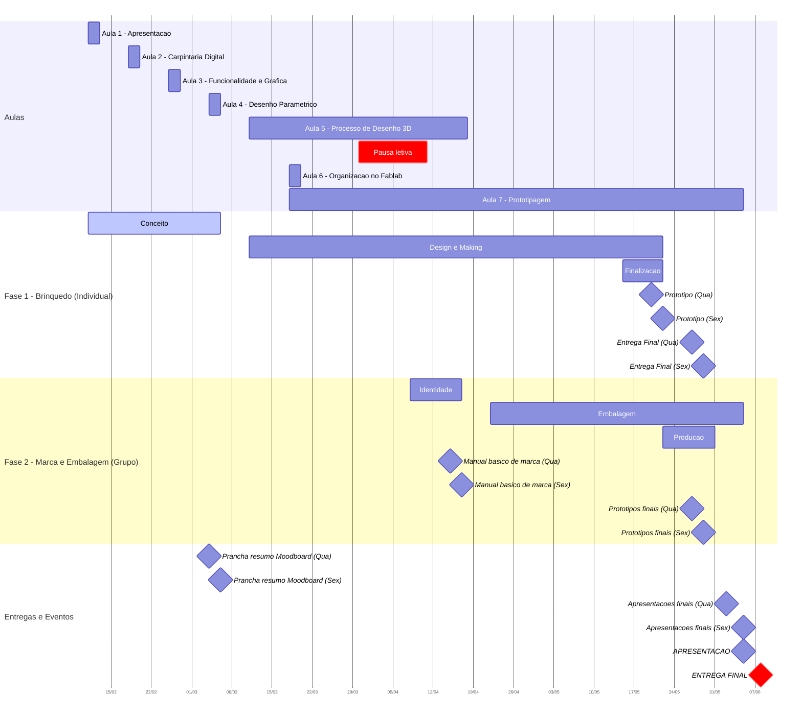

# Calendário

###  Plano de Atividades e Entregas

| **Fase**                                                     | **Datas**                    | **Tarefas**                                                                                                                             | **Fase?**                                                                       | **Tipologia**    |
| ------------------------------------------------------------ | ---------------------------- | --------------------------------------------------------------------------------------------------------------------------------------- | ------------------------------------------------------------------------------- | ---------------- |
| **Conceito**                                                 | 11/02/2026 → 06/03/2026      | • Pesquisa de referências tradicionais  • Análise de materiais disponíveis  •Desenvolvimento do conceito                    | Fase 1 - Brinquedo - Trab. Individual                                           | Etapa de Projeto |
| **Prancha resumo + Moodboard**                               | **04/03/2026 ou 06/03/2026** | 1 ou 2 PDF's (1920x1080px)                                                                                                              | Fase 1 - Brinquedo - Trab. Individual                                           | **Entrega**      |
| **Design & Making**                                          | 11/03/2026 → 22/05/2026      | •Desenvolvimento paramétrico  • Ciclos de prototipagem  • Testes e refinamentos                                             | Fase 1 - Brinquedo - Trab. Individual                                           | Etapa de Projeto |
| **Identidade**                                               | 08/04/2026 → 17/04/2026      | •Desenvolvimento marca  • Moodboard e pesquisa  • Sistema visual                                                            | Fase 2 - Id e Embalagem - Trab. de Grupo                                        | Etapa de Projeto |
| **Manual básico de marca**                                   | 15/04/2026 ou 17/04/2026     | - máximo de 4 pranchas PDF, 1920x1080 px                                                                                                | Fase 2 - Id e Embalagem - Trab. de Grupo                                        | **Entrega**      |
| **Protótipo (data de referência)**                           | 20/05/2026 ou 22/05/2026     | idealmente já é fruto de várias iterações e está muito próximo, senão na forma, cores e textura geral pretendida                        | Fase 1 - Brinquedo - Trab. Individual                                           | **Entrega**      |
| **Embalagem**                                                | 22/04/2026 → 05/06/2026      | •Desenvolvimento estrutural  • Testes materiais  • Protótipos                                                               | Fase 2 - Id e Embalagem - Trab. de Grupo                                        | Etapa de Projeto |
| **Pausa Letiva**                                             | 30/03/2026 → 11/04/2026      | Pausa de aulas (Páscoa)                                                                                                                 |                                                                                 |                  |
| **Finalização**                                              | 15/05/2026 → 22/05/2026      | • Documentação fotográfica  • Preparação pranchas finais  • Organização dossier digital                                     | Fase 1 - Brinquedo - Trab. Individual                                           | Etapa de Projeto |
| **Protótipos finais de Embalagens**                          | 27/05/2026 ou 29/05/2026  | Ficheiros Técnicos                                                                                                                      | Fase 2 - Id e Embalagem - Trab. de Grupo                                        | **Entrega**      |
| **Entrega Final**                                            | 27/05/2026 ou 29/05/2026  | - Duas pranchas resumo (1920x1080px)  - Dossier Notion completo  - Ficheiros paramétricos  - Documentação do processo | Fase 1 - Brinquedo - Trab. Individual                                           | **Entrega**      |
| **Produção (embalagens de amostra / impressão)**             | 22/05/2026 → 31/05/2026      | • Finalização sistema  • Impressão  • Documentação                                                                          | Fase 2 - Id e Embalagem - Trab. de Grupo                                        | Etapa de Projeto |
| **Apresentações Finais com Módulo de Design de Comunicação** | 02/06/2026 ou 05/06/2026     | Sistema completo (Protótipos, Apresentação Slides e Documentação Notion Grupo / Individual)                                             | Fase 1 - Brinquedo - Trab. Individual, Fase 2 - Id e Embalagem - Trab. de Grupo | **Entrega**      |
| **APRESENTAÇÃO**                                             | 05/06/2026                   | Apresentação pública dos projetos                                                                                                       |                                                                                 | **Evento**       |
| **ENTREGA FINAL**                                            | 08/06/2026                   | Última data para entrega de todos os materiais                                                                                          |                                                                                 | **Deadline**     |

---

## Gantt

## Notas Importantes

- **Período letivo:** 11 de Fevereiro - 05 de Junho de 2026 (15 semanas)
- **Pausa Letiva:** 30 de Março - 11 de Abril (semana da Páscoa)
- **Aulas:** Quartas-feiras (2 turmas) e Sextas-feiras (1 turma)

