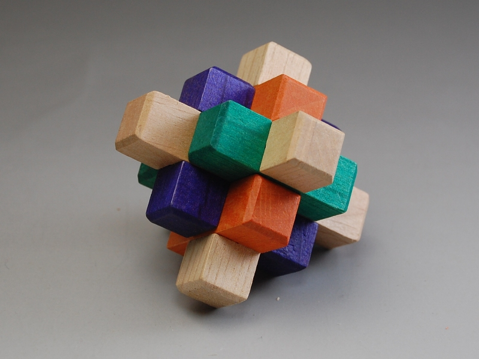
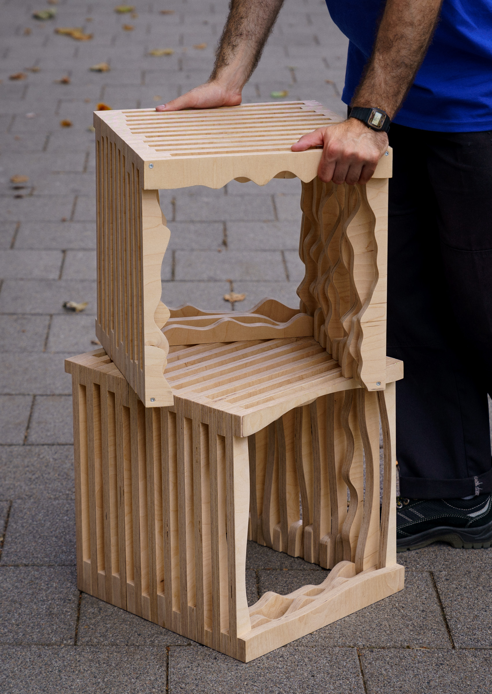
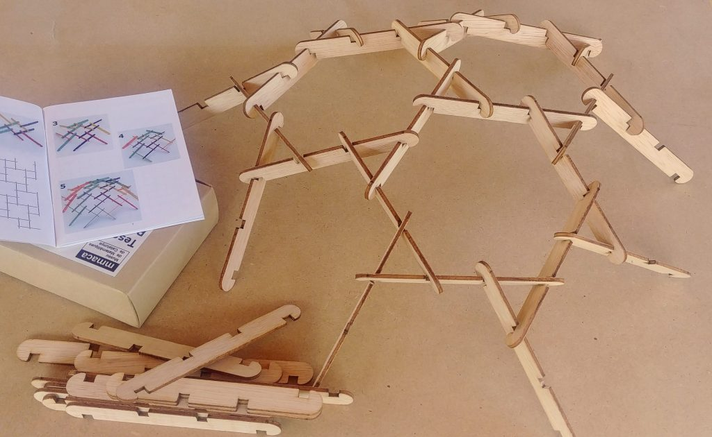
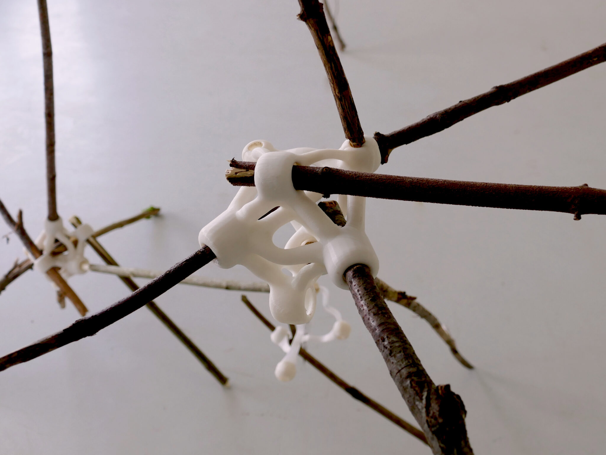

# Projeto Nestor - Produtos
Brinquedos de Madeira em Desperdício Zero - Trabalho Individual
## Fase 1

## Enquadramento

### Introdução

O **Projeto NESTOR** é uma iniciativa de investigação que explora a interseção entre sustentabilidade industrial, design e fabricação digital. No seu núcleo, o projeto visa desenvolver um sistema inteligente que otimize a utilização de material excedente da indústria do mobiliário, através da inserção automática de pequenos brinquedos de madeira nas áreas não utilizadas dos planos de corte CNC.

O projeto ganha uma dimensão cultural adicional ao explorar a rica tradição global de brinquedos em madeira. Da engenho dos mecanismos de Leonardo da Vinci, cujo sistema modular permite infinitas possibilidades construtivas, aos brinquedos tradicionais japoneses (como os Kumiki puzzles), passando pelos clássicos [blocos de construção Froebel que influenciaram Frank Lloyd Wright](https://www.froebelweb.org/web2000.html), existe um vasto património de design modular e sistemas de encaixe em madeira. Esta herança demonstra como a simplicidade material pode gerar complexidade funcional e valor pedagógico através de designs inteligentes. Aliando estes princípios históricos às tecnologias digitais contemporâneas, procuramos criar uma nova geração de brinquedos que combine tradição construtiva com sustentabilidade industrial.

[https://yosegijapan.com/yosegi-products/kp991/](https://yosegijapan.com/yosegi-products/kp991/)

A ESELx - Instituto Politécnico de Lisboa pretende contribuir para esta iniciativa através da participação dos seus alunos de design na criação de uma biblioteca digital de brinquedos. Esta biblioteca servirá como base de dados para um software de otimização que analisará ficheiros G-code/NC de routers CNC industriais, identificando espaços vazios nos planos de corte e sugerindo automaticamente a inserção de peças desta coleção de brinquedos.

### Tecnologia

O projeto NESTOR está centrado utilização da tecnologia CNC (Controlo Numérico Computorizado) como ferramenta de fabricação de componentes de mobiliário de madeira em contexto industrial. Esta tecnologia permite não só a precisão necessária para sistemas de encaixe complexos, como também a adaptabilidade dimensional que caracteriza o projeto. A fabricação digital, especificamente através do corte CNC, possibilita a criação de peças com tolerâncias consistentes e a repetibilidade necessária para sistemas modulares. O processo tecnológico deve considerar as limitações e potencialidades específicas do corte CNC: a bidimensionalidade do corte, a importância do desenho de encaixes precisos, e a necessidade de otimizar o uso do material. A parametrização do desenho, fundamental para o projeto, permite que um mesmo design possa ser adaptado a diferentes dimensões de material excedente, mantendo as proporções e funcionalidades essenciais.

[https://www.fictionfactory.nl/en/sustainability/found-objects/](https://www.fictionfactory.nl/en/sustainability/found-objects/)

#### *Requisitos técnicos base:*

*Designs modulares e escaláveis;
Adaptáveis a diferentes espessuras standard de material
Definição clara de dimensões
Documentação de restrições para o software
Consideração das ferramentas CNC standard da indústria (diâmetros e tipologias)*

### Conceito

O desenvolvimento conceptual do projeto parte da análise de sistemas modulares históricos e brinquedos tradicionais em madeira, com particular atenção aos mecanismos e princípios construtivos que permitiram a sua longevidade. Esta pesquisa pode seguir diversos caminhos: desde os mecanismos de Leonardo da Vinci aos puzzles Kumiki japoneses, dos blocos Froebel aos brinquedos de construção modernos, procuramos compreender como a simplicidade material pode gerar complexidade funcional através de designs inteligentes.

O rico património de brinquedos tradicionais oferece inúmeras possibilidades de investigação. Em Portugal, por exemplo, encontramos desde os engenhosos piões e rocas do Norte, que combinam movimento e som, até aos jogos de construção com sistemas de encaixe tradicionais.

O conceito pode explorar diferentes vertentes: sistemas de encaixe e modularidade que permitam construção livre; mecanismos que gerem movimento ou transformação; objetos que combinem jogo e aprendizagem; ou peças que estimulem a criatividade através da sua recombinação. A adaptabilidade dimensional inerente ao projeto não deve comprometer a integridade do conceito - pelo contrário, deve ser integrada como parte fundamental do mesmo, permitindo que diferentes escalas ofereçam diferentes possibilidades de interação.

A pesquisa pode ainda estender-se a áreas adjacentes como autómatos mecânicos, brinquedos óticos, ou sistemas de construção arquitetónicos tradicionais, procurando princípios que possam ser traduzidos para o universo do brinquedo. O importante é que o conceito desenvolvido demonstre uma compreensão profunda dos princípios de design que fazem um brinquedo verdadeiramente intemporal.

[https://mmaca.cat/es/moduls/cupules-leonardo/](https://mmaca.cat/es/moduls/cupules-leonardo/)

### Enquadramento Económico: Design Distribuído e Aberto

O Design Distribuído e Aberto representa um modelo económico e social onde os projetos são desenvolvidos globalmente mas produzidos localmente. Neste contexto, o design não é um produto final fixo, mas um conjunto de instruções e parâmetros que podem ser adaptados a diferentes contextos e necessidades. Esta abordagem permite que o mesmo design básico possa ser produzido em diferentes locais, utilizando materiais excedentes disponíveis localmente, e adaptando-se a diferentes contextos culturais e económicos. O modelo open-source garante que os designs podem ser não só reproduzidos, mas também modificados e melhorados pela comunidade global, criando um ecossistema de inovação distribuída. A documentação clara e completa do processo torna-se assim tão importante quanto o produto final.

[https://distributeddesign.eu/talent/froidevaux-scott/](https://distributeddesign.eu/talent/froidevaux-scott/)

### Aspetos Funcionais do Brinquedo

A funcionalidade de um brinquedo transcende o seu uso imediato, englobando aspetos pedagógicos, de segurança e de desenvolvimento. Um brinquedo bem desenhado deve promover o desenvolvimento motor e cognitivo, adaptando-se a diferentes fases de crescimento e permitindo diversos níveis de interação. A segurança é um aspeto crucial: todos os componentes devem considerar riscos de utilização, desde o dimensionamento mínimo das peças até à ausência de arestas cortantes. A durabilidade do brinquedo deve ser considerada não apenas em termos físicos, mas também em termos do interesse que consegue manter ao longo do tempo, permitindo diferentes formas de utilização e descoberta. A manutenção e o eventual fim de vida do brinquedo devem também ser considerados, privilegiando soluções que permitam a reparação ou substituição de componentes, e garantindo que o fim de vida do objeto não representa um impacto ambiental significativo.

A funcionalidade de um brinquedo transcende o seu uso imediato, englobando aspetos pedagógicos, de segurança e de desenvolvimento. Um brinquedo bem desenhado deve promover o desenvolvimento motor e cognitivo, adaptando-se a diferentes fases de crescimento e permitindo diversos níveis de interação.

[Trabalho de Maria Monteiro 2024-25](https://www.notion.so/KIT-SAVANA-210a4ae006aa801f858ae08aabe426c2)

A segurança é um aspeto crucial e regulamentado pela Diretiva de Segurança de Brinquedos da UE. Os designs devem considerar:

- Adequação à idade (especialmente importante para menores de 3 anos)
- Segurança física e mecânica (dimensionamento adequado de peças, ausência de arestas cortantes)
- Segurança dos materiais (acabamentos não tóxicos, tratamentos adequados da madeira)
- Requisitos de higiene e manutenção

A durabilidade do brinquedo deve ser considerada não apenas em termos físicos, mas também em termos do interesse que consegue manter ao longo do tempo, permitindo diferentes formas de utilização e descoberta. A manutenção e o eventual fim de vida do brinquedo devem também ser considerados, privilegiando soluções que permitam a reparação ou substituição de componentes, e garantindo que o fim de vida do objeto não representa um impacto ambiental significativo.

Toda a documentação do projeto deve incluir indicações claras sobre idade recomendada, advertências de segurança e instruções de montagem e manutenção, em conformidade com os requisitos europeus.

| Aspecto             | Questões a Considerar                                                                                                                                                |
| ------------------- | -------------------------------------------------------------------------------------------------------------------------------------------------------------------- |
| **Desenvolvimento** | • Capacidades motoras desenvolvidas • Níveis de compreensão e abstração • Faixa etária alvo • Evolução da interação ao longo do tempo                       |
| **Segurança**       | • Dimensionamento de peças • Resistência dos materiais • Acabamentos e toxicidade • Prevenção de falhas e ruturas                                           |
| **Utilização**      | • Individual vs. coletivo • Nível de supervisão necessário • Ambiente de uso (interior/exterior) • Mobilidade • Impacto sonoro • Manutenção e limpeza |
| **Ciclo de Vida**   | • Durabilidade vs. interesse • Reparação • Gestão de fim de vida • Impacto ambiental • Reciclagem                                                        |

*A documentação destes requisitos é essencial tanto para o processo de design como para alimentar os parâmetros do sistema NESTOR, que deverá respeitar estas condicionantes nas suas propostas de otimização e adaptação.*

## Calendário

[Calendario](Calendario.md)

## Avaliação (100%)

1. **Conceito (30%)**
    - Re-interpretação, Inovação e síntese formal
    - Adequação funcional
2. **Processo (40%)**
    - Articulação técnica/conceptual
    - Desenvolvimento paramétrico
    - Iterações (e pertinencia das mesmas)
3. **Execução Técnica (20%)**
    - Utilização das ferramentas (esboço, desenho paramétrico, fabricação digital, etc)
4. **Comunicação e Documentação (10%)**
    - Qualidade dos protótipos
    - Ficheiros técnicos
    - Apresentação visual

## Recursos Técnicos

- FabLab ESELx
- Software paramétrico
- Materiais excedentes
- Documentação CNC

## Referências (em atualização)

[Untitled](Projeto%20NESTOR%20-%20Brinquedos%20de%20Madeira%20em%20Desperd%C3%AD/Untitled%2019c51eb0172280929382e5511e2e18ab.csv)

### Fabricação Digital

- [Guerrilla guide to CNC machining, mold making, and resin casting](http://lcamtuf.coredump.cx/gcnc/)
- [Guide to CNC A-Z](http://docs.academany.org/FabAcademy-Tutorials/_book/en/week7_computer_controlled_machining/cnc_tips.html)
- [Introduction to CNC](http://docs.academany.org/FabAcademy-Tutorials/_book/en/week7_computer_controlled_machining/cnc.html)

### 

- Publishers, B. (2011). *Open Design Now: How Design Can No Longer Be Exclusive*. BIS Publishers.

### Brinquedos Tradicionais e Sistemas Modulares

- The Froebel Gifts Archive - [https://froebelgifts.com/](https://froebelgifts.com/)

###