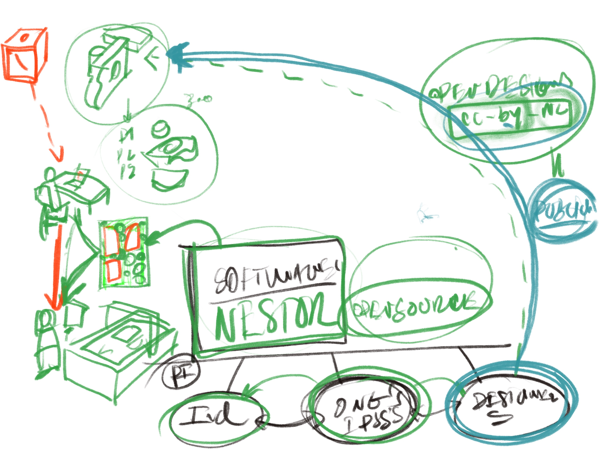

# Conteúdos - Discussão do Enunciado e Introdução à Fabricação Digital

### Objetivo

- (deriva da aula anterior)
	- o que é o projeto NESTOR?
	- integrar a utilização do esquema-ferramenta (framework) sobre as partes constituintes de um projeto;
	- compreender em que situações posso aplicar o esquema-ferramenta
	  
- O que é esperado da CNC na produção de cada peça de um brinquedo NESTOR.

### Instruções / Atividades

- Usar o **Esquema-Ferramenta** para:
	  . a arrumar os conteúdos do enunciado, para o ir percebendo e colocando as diferentes questões acerca do mesmo que deverão surgir ao longo do semestre; 
	  . Testar mentalmente a coerência e pertinência (força) das minhas ideias/propostas:
		  . Quais dos meus esboços/maquetes respondem melhor à forma como me organizei para resolver o problema, ou seja, como interpretei o que me era pedido e que soluções vou privilegiar em cada um dos pontos do esquema?
	  . Apresentar essas mesmas propostas, para que fique claro em todas as suas dimensões.
	  
  - Começar a avaliar os meus desenhos à luz do que é possivel fazer e dos materiais disponiveis. essa avaliação pode implicar a sua rejeição, pois modificar para ser possivel desvirtua a ideia/(conceito) ou inviabiliza as funções que quero mesmo que estejam presentes. ou então pode motivar alterações para o viabilizar tecnologicamente, enquanto mantem, ou compromete pouco as minhas restantes intenções.

### Recursos

#### Sobre Projeto

##### Framework Base

##### O Projeto Nestor

### Sobre a CNC!

[Neste link](https://fablabbenfica.gitlab.io/fablabbenficadocs/machines/ouplan/), encontrarão toda a informação necessária sobre a utilização da CNC Ouplan STEEL que está disponível no Fablab Benfica. logo de inicio encontram Inclusive um video geral.

