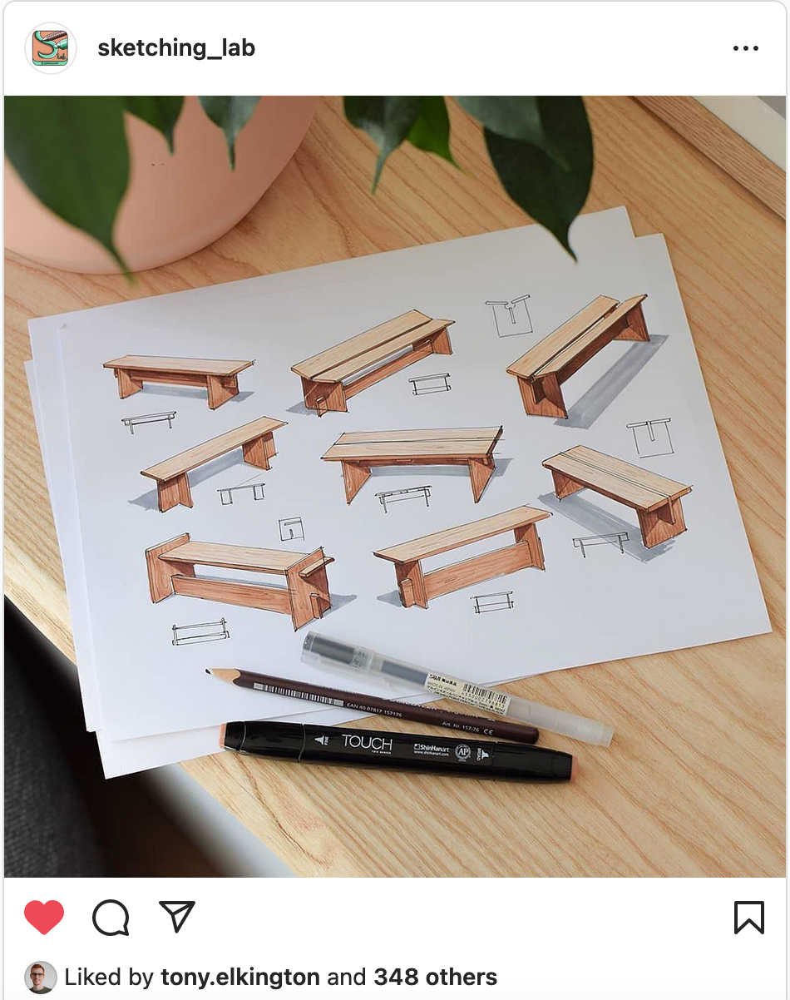

# Conteúdos - Funções, Requisitos de Uso e Apresentação Gráfica

## Objetivos

- Conhecer os principais **formatos e ferramentas exploratórias** no processo de design: esboço, maquete, recortes, entre outros.
- Perceber o que é uma **prancha-resumo** e como se relaciona com o esquema-ferramenta:
    - Como organizar e sintetizar a diversidade de explorações numa peça de comunicação clara.
    - A prancha-resumo como peça **evolutiva** — acompanha o projeto desde os primeiros esboços até ao protótipo, passando por renders, desenhos técnicos e diagramas.
- Discutir a **função brincadeira** e os restantes aspetos funcionais do produto.
- Definir **requisitos de uso**.

---

## Instruções

**Como representas formas tridimensionais de modo a compreendê-las em pleno?**

Reflete sobre qual o formato que te dá mais segurança — desenho estrutural, maquete, peças de referência, combinação de vários.

Neste ponto é essencial distinguir dois tipos de desenho:

- O **desenho que ilude** — que joga com sombras, luz e perspetiva para criar uma impressão visual convincente, mas que pode esconder indefinições.
- O **desenho estrutural** — que procura representar de forma tão rigorosa quanto possível os objetivos do projeto, mesmo numa fase inicial, sem ambiguidades sobre a forma, as dimensões ou o funcionamento.

**Desenho Estrutural — como fazer**

Preparei um video curto de demonstração:

- **A partir de um paralelepípedo** — exploro formas aleatórias "esculpindo" o volume em desenho, definindo progressivamente a forma tridimensional.
- **A partir de elipses** — represento objetos em revolução, construindo o volume a partir do eixo e das secções.
  

---

**Demonstração aplicada — um banco em carpintaria digital**

Para nos distanciarmos da ideia imediata de "brinquedo de madeira" — embora o condicionamento de **T** seja o mesmo — uso um banco como objeto de trabalho.

A sequência é a seguinte:

1. **Exploração livre** — vários esboços sem compromisso.
2. **Escolha de uma forma** — selecionar a direção mais interessante.
3. **Recentrar no plano** — ajustar e estabilizar a proposta.
4. **Construção por camadas** — preparar progressivamente uma apresentação em formato prancha-resumo.

A prancha deve seguir uma **estrutura narrativa** que mostre, de forma coordenada, como o projeto responde às restrições de **T**, qual o **conceito** e como se manifesta em termos de forma, cor e textura, e como o objeto **funciona**. Deve ainda incluir elementos que ajudem a perceber a **escala** e ilustrar pelo menos uma **ação de uso** que facilite a compreensão da proposta.
   

---

**Ponto de partida bidimensional** _(demo em breve)_

Um ponto de partida muito gráfico e de síntese visual, diretamente informado pelo moodboard. Essencial neste projeto — a linguagem gráfica que o grupo definiu em conjunto deve ser um dos motores do desenho desde o início.

**Referências de sketching**

Abaixo deixo referências de designers especializados nesta área — com um nível de execução muito superior à demo ao vivo, mas que ilustram bem o que o desenho estrutural pode ser quando desenvolvido com prática.

## Recursos

#### Sketching

## References

- [Tony Elkington](https://www.instagram.com/tony.elkington/)
- [Mau G.V.](https://www.instagram.com/mau_g.v/)
- [Marius Kindler](https://mariuskindler.com/) — [Instagram](https://www.instagram.com/marius.kindler/)
- [Sketch a Day](https://www.youtube.com/c/sketchadaydotcom)
- [JP99 Design](https://www.instagram.com/jp99_design/)
- [Mike Jacobs Design](https://www.instagram.com/mikejacobsdesign/)
- [Kadabra Carl](https://www.instagram.com/kadabracarl/)
- [Harry IBZ Design](https://www.instagram.com/harryibzdesign/)
- [Mark Mazzone Design](https://www.instagram.com/_markmazzonedesign/)
- [Design Sketching](https://www.instagram.com/designsketching/)
- [Cameron BDL](https://www.instagram.com/cameronbdl/)

## Courses

- [Introdução ao Sketching para Design de Produto — Fran Molina (Domestika)](https://www.domestika.org/pt/courses/1433-introducao-ao-sketching-para-design-de-produto/course)

## Avaliação

