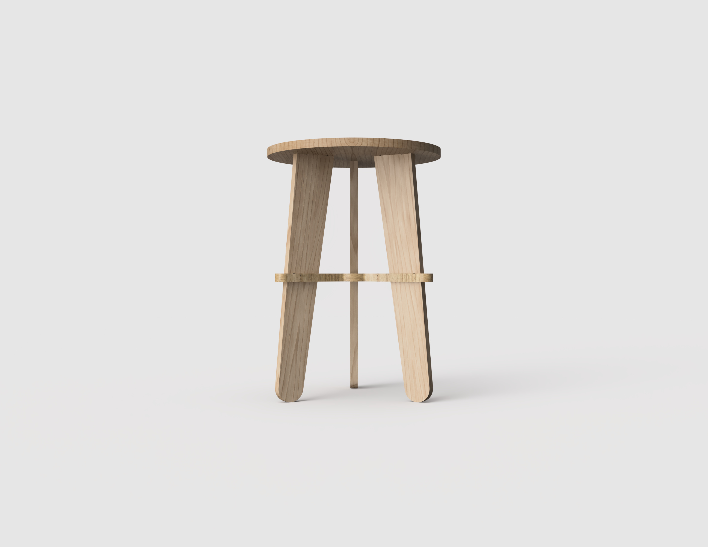
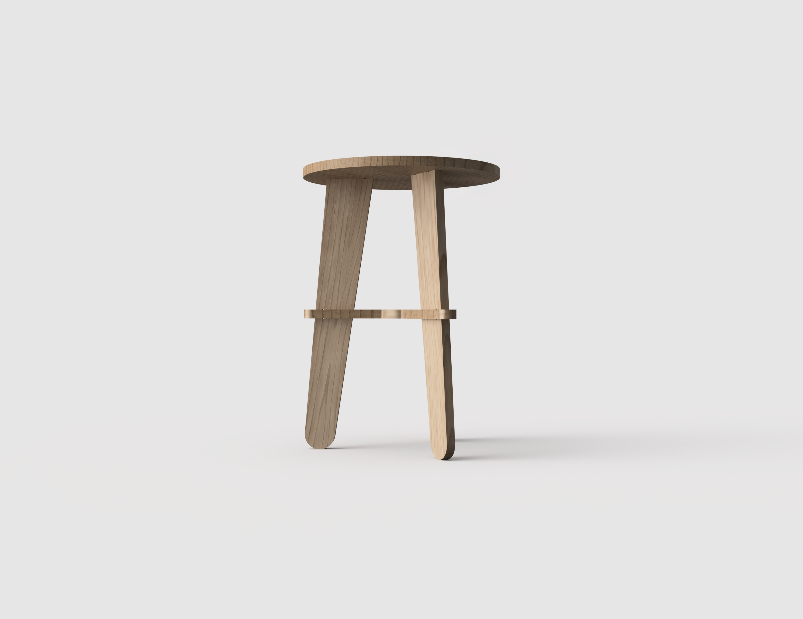
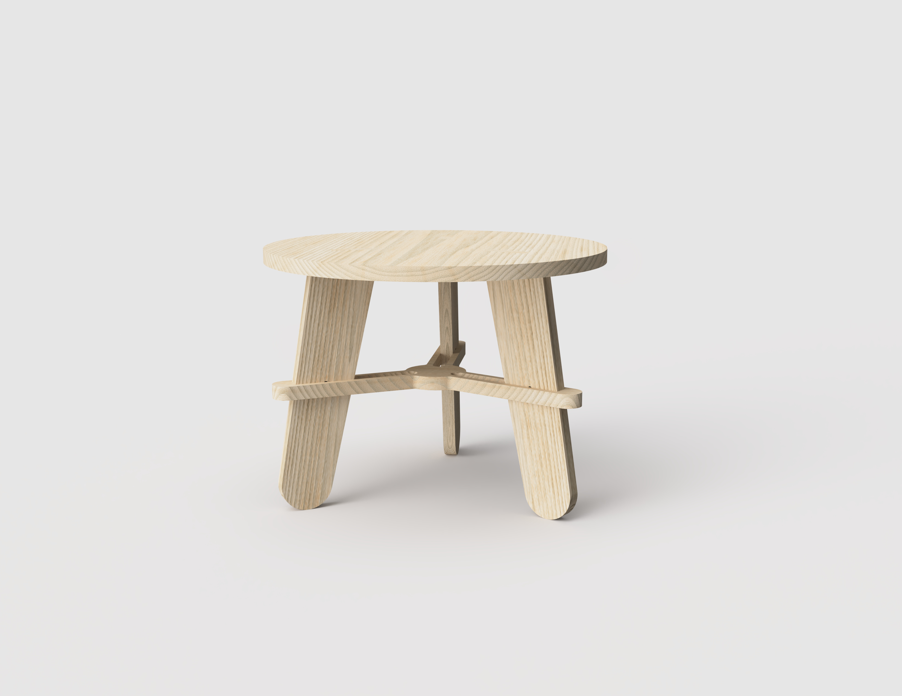
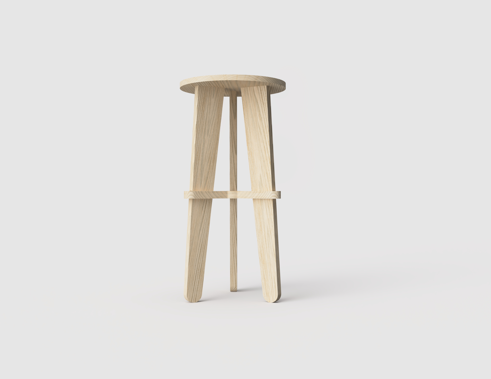
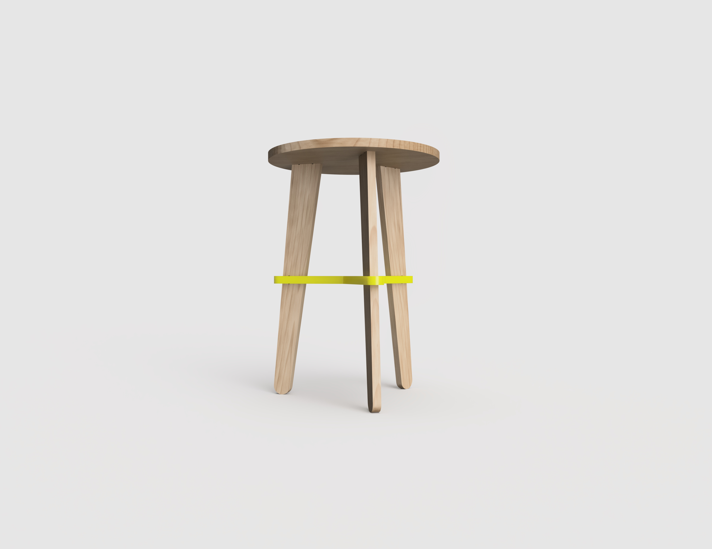
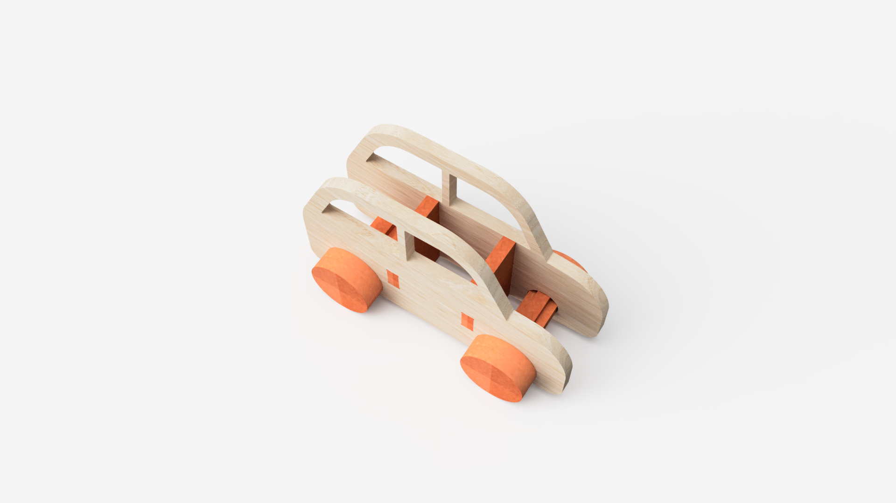

# Conteúdos - Introdução ao Desenho Paramétrico

## Objetivo

## Instruções

1 - Compreender muito bem o interface to Fusion 360

2 - Organização do trabalho em Fusion.
	. Criar sempre um projeto na nossa cloud (não ficheiros passados em pen, tão pouco qq tipo de ficheiro local)

## Recursos

### Introdução ao Fusion 360

[100IntroFusion360](../../Recursos/100IntroFusion360.md)

### Introdução à Carpintaria Digital

[200CarpDigitalFusion360](../../Recursos/200CarpDigitalFusion360.md)

### Ficheiros para estudo:

https://a360.co/4suF4lk

https://a360.co/4b6z5Mt

https://a360.co/4w1Nvr9

https://a360.co/4sMwxKo

!!! note "Recursos em Construção"
      Iremos adicionando recursos e atualizando até ao final do semestre!

