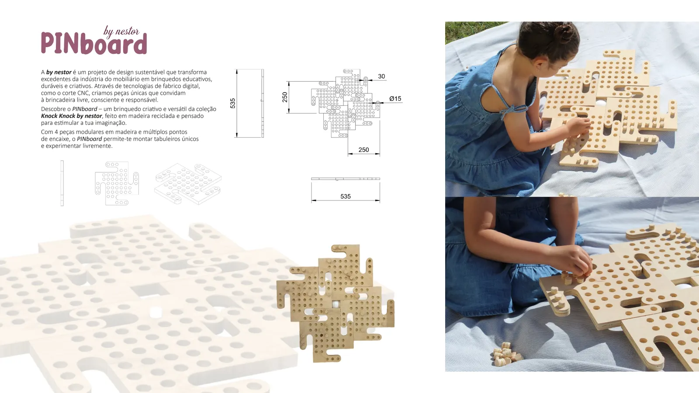

# Design de Produto IV
Bem-vindo à documentação do módulo de Design de Produto IV.

## Conteúdos
- [Programa e Avaliação](Avaliacao.md)
- [Calendário](Calendario.md)
- [Projeto Nestor - Produtos - Fase 1 - Individual](Enunciado.md)
- [Projeto Nestor - Marca e Embalagem - Fase 2 - Grupo]()

# Horario

| Dia | Horario | Turma |
| --- | --- | --- |
| Qua | 08:30 - 10:45 | 2J |
| Qua | 11:00 - 13:15 | 2M |
| Sex | 11:00 - 13:15 | 2L |

*Trabalho de Andreia Vieira 2024-2025*

