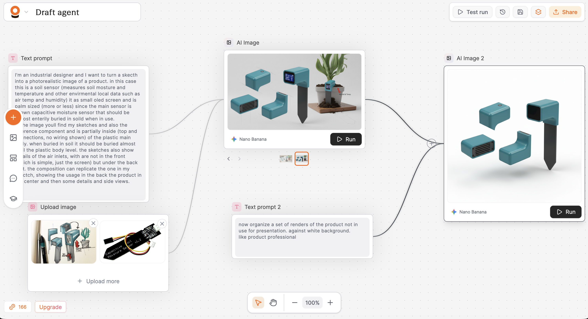
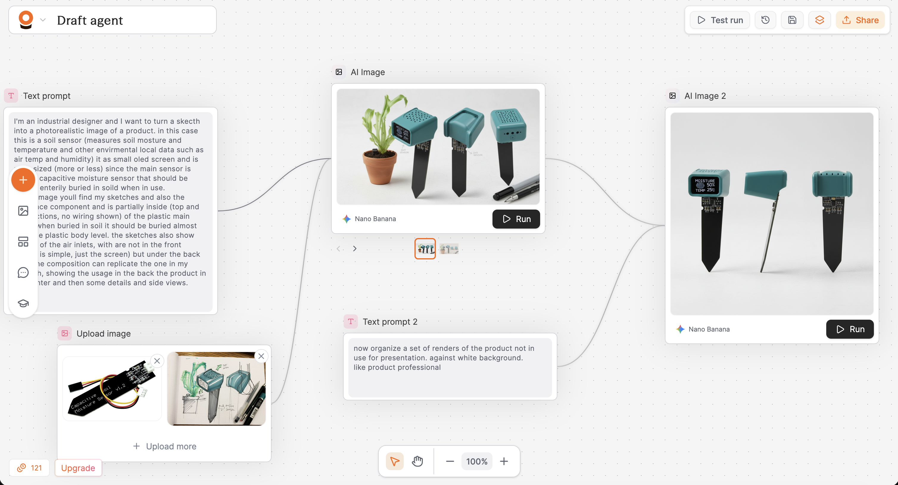
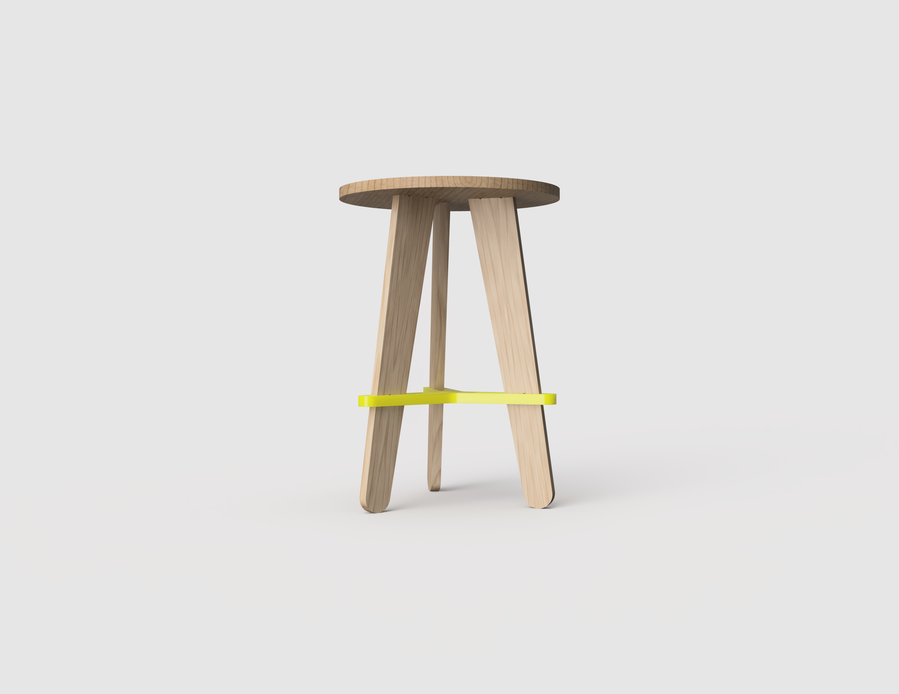
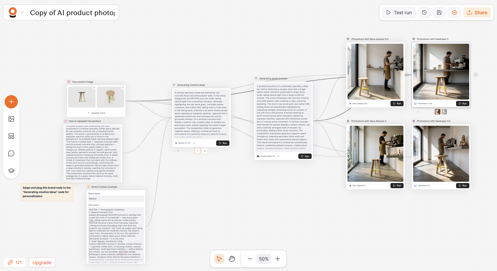
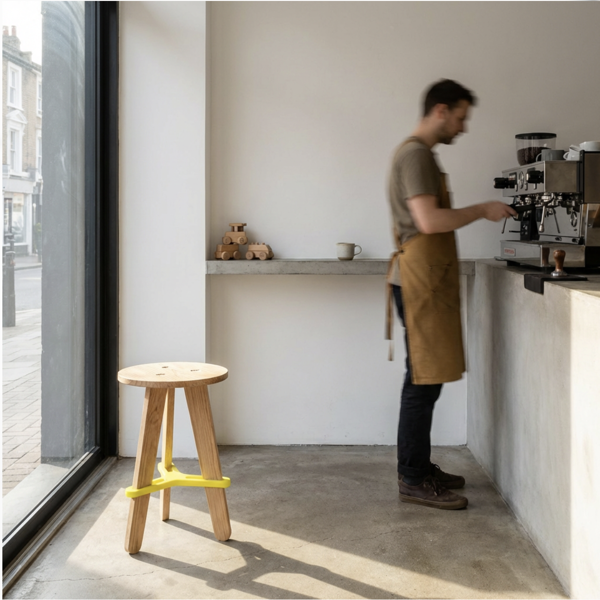
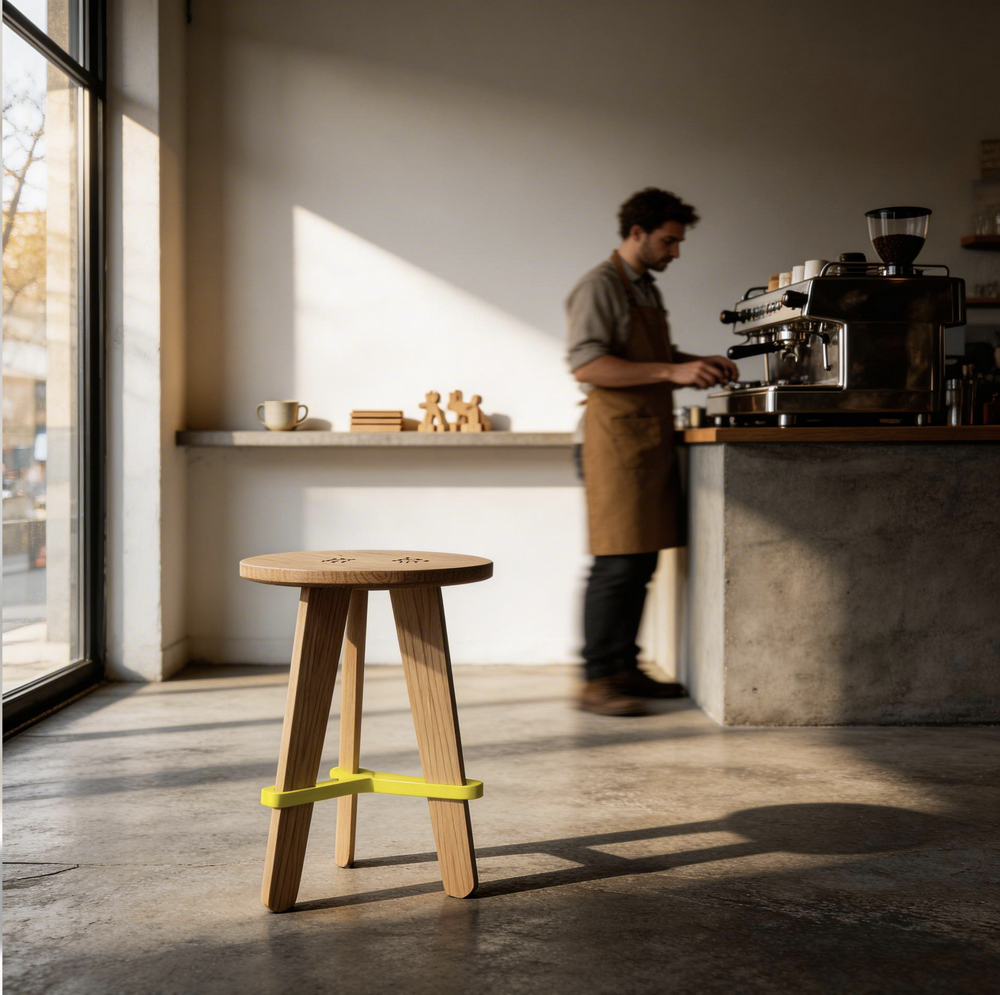

# Diário e partilha de experiencias com AI generativa e LLM's com potencial de aplicação em processos de Design de Produto e Fabricação Digital

## Sketch to Render - Potenciar apresentações de conceito

Nesta experiência recorri a uma conta gratuita de [pletor.ai](https://pletor.ai) onde inseri uns esboços meus antigos de forma a tentar explorar formas de visualização e até de interpretação alheia (?) da minha proposta.

Assumindo alguns erros de interpretação, principalmente no que toca à integração do componente decidi agarrar nuns renders de demonstração recentes e numa receita de workflow fornecida pelo próprio Pletor.AI e preparar um photoshoot profissional do (não-)produto de demonstração que havia desenhado no contexto da produção de recursos para o Fusion360:

## Do render à Sessão Fotográfica:

### Processo:
#### (atenção que se trata de um processo meramente experimental e recheado de lugares comuns, da minha parte e da parte do LLM. Não tive qualquer intenção de trabalhar um conceito sólido. Talvez erradamente apenas quis testar o potencial da ferramenta, e provavelmente estarei a contribuir para o comum processo de normalização e medianização associado a estas ferramentas)

1. **Pedi os elementos textuais de arranque a um LLM (Claude, ChatGPT, etc) com a seguinte prompt (fornecendo a que já estava no template original do pletor.ai):**
   
   "similar to this kind of formulation I want one for my stool design:

*"Concept 1: Urban Jungle Transition A dynamic product shot showcasing the white Salomon trail running shoe positioned at the dramatic intersection where concrete meets nature. The scene captures a crumbling urban wall or weathered concrete steps transitioning into lush tropical vegetation typical of South Asian cities like Mumbai or Bangkok. Vibrant green ferns and monsoon-fed plants emerge from cracks in the pavement, creating a natural gradient from hard urban surfaces to soft jungle floor. The shoe sits confidently on this boundary, with one side touching smooth concrete and the other resting on rich, dark earth dotted with fallen leaves. Dappled sunlight filters through overhead canopy, casting dynamic shadows that emphasize the shoe's technical details and all-terrain capabilities. The composition suggests seamless movement between city streets and nature trails."*

in this case I want the concept to be origins cofee, minimal space, concrete, white, marzoco machine in the background, people in organic slow fashion clothes sitting, waiters with motion blur.

organize the prompt please"

2. O que resultou em:**
   
   *"**Concept: Origins Coffee Bar***

*A refined product shot showcasing the stool positioned in a minimal specialty coffee space defined by raw concrete surfaces and a restrained white palette. The scene is anchored by a La Marzocco espresso machine softly out of focus in the background, its polished metal catching ambient light. The interior is pared back — exposed concrete walls, smooth poured concrete floor, minimal shelving — letting the stool's form speak clearly in the foreground. Seated patrons in organic, earth-toned slow fashion garments occupy the mid-ground, their relaxed postures conveying unhurried ritual. A waiter crosses the frame with deliberate motion blur, a streak of movement that contrasts with the stillness of the stool and its surroundings, reinforcing the object's grounded presence. Natural light enters from a large storefront window, washing the concrete in soft, cool tones and casting long, gentle shadows. The composition positions the stool as the quiet protagonist of a space where material honesty, craft, and slow living converge."*

... que copiei de modo acrítico para a prompt respetiva do pletor subsituindo o do exemplo!!! (não repitam isto em casa :) )

3. depois criei também a prompt de substituição para a sessão fotográfica pp dita, que também alimentei com o enúnciado que preparei para o Nestor este ano (fui tão preguiçoso que até lhe disse que extraordinariamente uma peça de mobiliário faria parte da iniciativa para promoção e financiamento da mesma!):
   
   *"want a similar organization to this:*

*"Below are our photographic guidelines 1. Adventure-First Context Always photograph products in authentic outdoor or real-life adventure settings. Salomon has powered workdays, road trips, and outdoor adventures for over a century, becoming an essential part of these experiences. Show the product being used during camping trips, hiking expeditions, work breaks, or travel scenarios rather than sterile studio environments. 2. Built for Life Durability Focus Emphasize the rugged, unbreakable nature of Salomon products through dramatic lighting and composition. Stanley products are built to survive extreme conditions and have gotten even more durable over time. Use strong directional lighting to highlight the steel construction and showcase the product's ability to withstand harsh environments. 3. Lifestyle Integration Photograph products as natural extensions of active, purposeful lifestyles rather than isolated objects. Salomon has positioned itself as essential gear for rugged, active lifestyles. Show the products seamlessly integrated into daily routines, work environments, and adventure scenarios where they solve real problems."*

*for a social design brand named nestor:*

*the only thing is that in this case, not toys, but furniture to finance the initiatives... like side quest, nestor stool"*

4. O que resultou em:
   
   *"**NESTOR — Photographic Guidelines***

***1. Material Honesty First** Always photograph NESTOR furniture in settings that reveal the truth of its materials — raw wood grain, CNC milling marks left as texture, visible joinery. NESTOR furniture is born from the same industrial cutting processes and offcut logic that drive the project's toy research. Use close-up angles and raking light to celebrate the material's history: the sheet it came from, the precision of the cut, the warmth of unfinished or lightly oiled wood. Never hide the fabrication process — it is the story.*

***2. Quiet Spaces, Intentional Living** Position NESTOR furniture in minimal, honest interiors — specialty coffee bars, co-working studios, ceramic workshops, small apartment kitchens — where objects are chosen, not accumulated. NESTOR's design philosophy values material intelligence over material excess. Compose shots that let the piece breathe in negative space: concrete floors, white plaster walls, a single plant, a cup. The environments should feel curated but lived-in, never staged or aspirational in a conventional lifestyle sense.*

***3. The Side Quest Narrative** Frame every furniture piece as a visible ambassador for a larger, less visible mission. The NESTOR Stool is a "side quest" — a desirable object whose purchase directly finances research into CNC waste optimization and open-source toy libraries. When possible, include subtle visual cues that connect the furniture to the broader ecosystem: a stack of wooden toy prototypes on a nearby shelf, a CNC cutting plan pinned to a wall, children playing with modular wooden pieces in the background. The furniture is the gateway; the system is the story.*

***4. People as Context, Not Decoration** When people appear, they should be engaged in genuine activity — working, reading, conversing, making — not posing with the product. NESTOR values functional design that disappears into use. Capture motion blur on hands and bodies while the stool remains sharp and grounded. Wardrobe should lean toward workwear, organic textiles, and earth tones — people who make things, not people who buy things.*

***5. Process Transparency** Dedicate a portion of all visual communication to showing the making — the CNC router mid-cut, the nesting layout on a monitor, the offcuts sorted on a workshop table, the stool assembled without glue or fasteners. NESTOR's credibility rests on the legibility of its production logic. These process shots should maintain the same compositional care and lighting quality as the lifestyle imagery. The workshop is not behind-the-scenes content; it is the brand.*

***6. Modular Storytelling** Compose images that can function alone but gain meaning in sequence — a triptych moving from raw sheet material to nested cutting plan to finished stool in situ, or from furniture in a café to toy in a child's hand. NESTOR operates as an interconnected system where waste from one process becomes input for another. The photography should mirror this circularity, inviting the viewer to follow the material's journey across frames."*

Texto com o qual alimentei o o workflow do pletor.
O resultado final não é encantador, mas para uma apresentação rápida e de modo muito afinado, pode ser algo a considerar.

