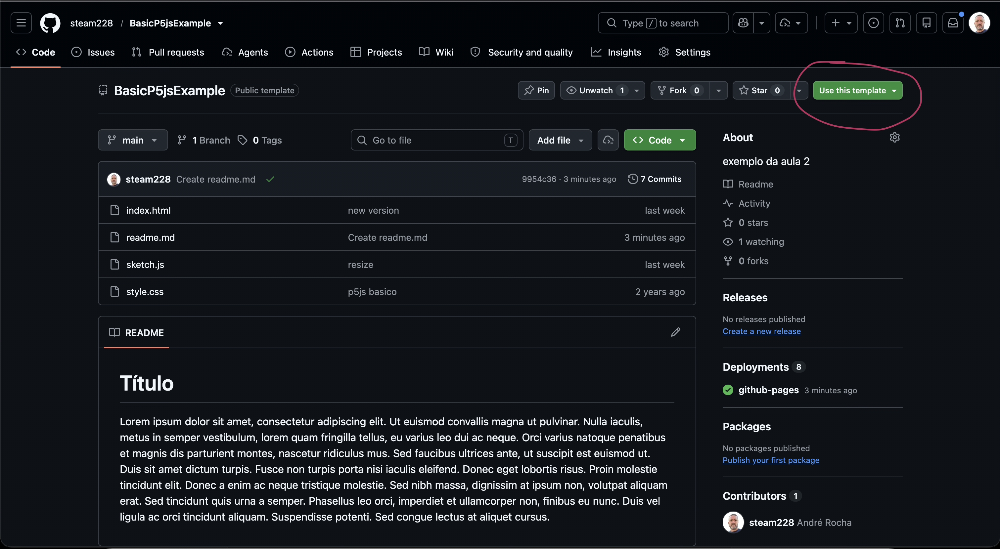
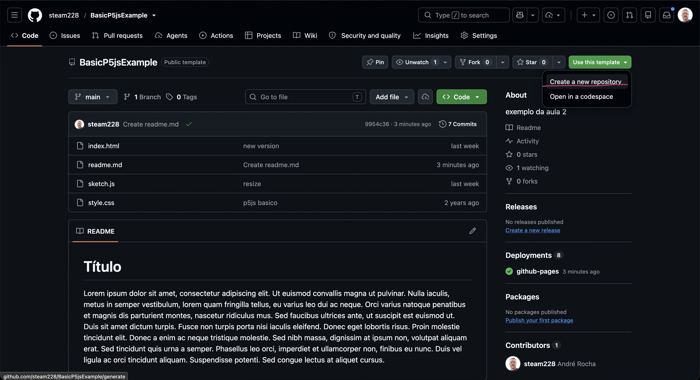
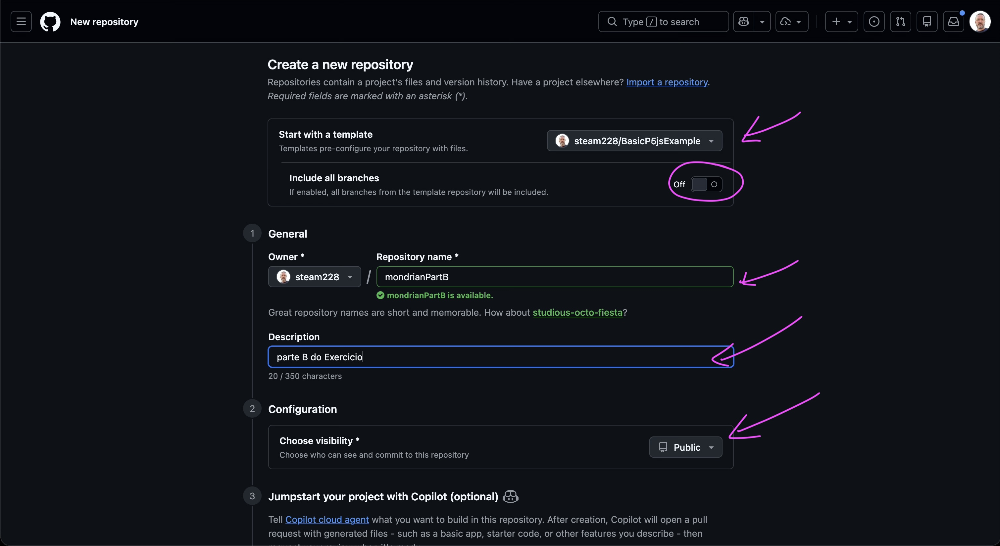
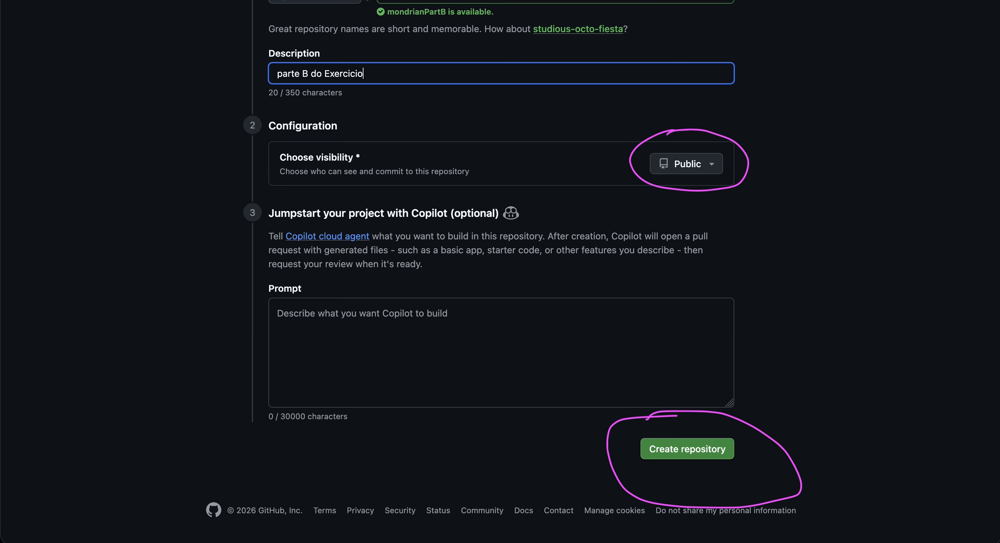

# update Configuração Base

## Video

## Passo-a-passo
Cada vez que quero começar um novo projeto:
1. ir ao repositório template
   https://github.com/steam228/BasicP5jsExample
   
2. "use template"
   
3. Criar Repositório
   
4. Open with Github Desktop (ou clonar na pp app do Github Desktop)
   
   
   atenção à escolha da pasta de destino
5. Abrir pasta no VsCode e editar
   

# Configuração Base para primeiros exemplos

### 1. instalar vscode: https://code.visualstudio.com/
### 2. conta github.com: https://github.com/

### 3. No vscode instalar a extensão live server:
   

     
### 4.clonar o repositorio: https://github.com/steam228/BasicP5jsExample
     

     
#### https://bit.ly/4yDBtVq
     
### 5. Open with github desktop (cuidado ao colocar a página)
   
   
### 6. selecionem a pasta de destino (lá ficará este template para usarem sempre que querem fazer um código novo)
   

### 7. Sempre que quiserem iniciar um projeto novo, criem uma pasta com o nome que quiserem e copiem lá para dentro os ficheiros base do exemplo que clonaram (o index.html, style.css e sketch.js).
  
