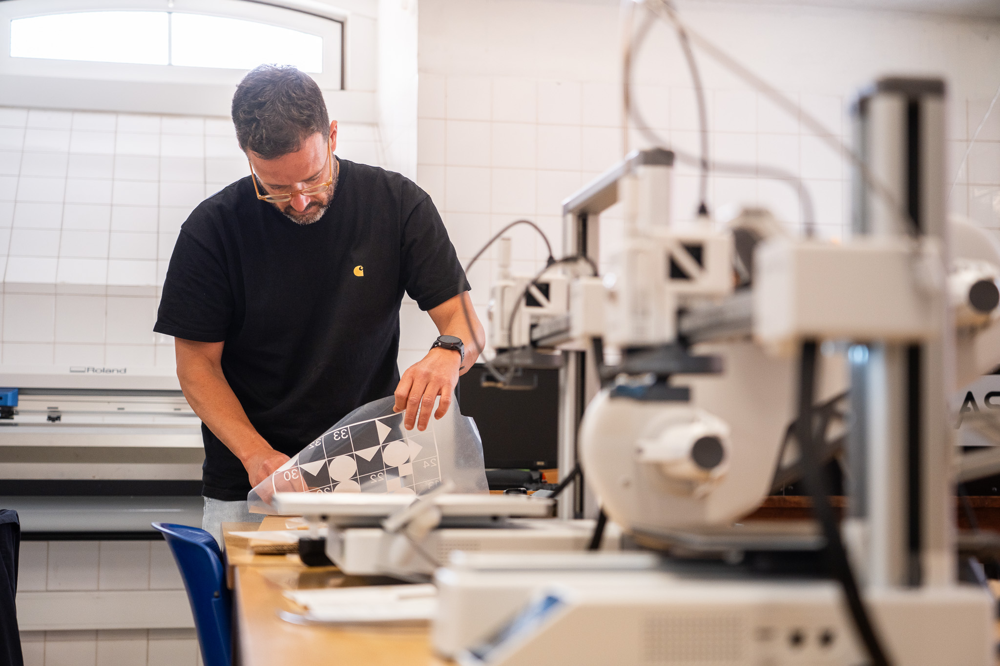

# Bem-vindos à minha página de Recursos Abertos

Olá. Sou **André Rocha**, Professor Adjunto em Design de Produto e Fabricação Digital na Escola Superior de Educação de Lisboa (ESELx/IPL) e na ESES/IPS, e cofundador e coordenador científico do [**Fablab Benfica**](https://fablabbenfica.pt). 
Esta página é um repositório de recursos educativos que apoiam as **Unidades Curriculares que leciono** em ambas as instituições, combinando enquadramentos teóricos e práticas *hands-on* de fabricação digital.
### O que vais encontrar aqui:

**Materiais das UCs**: Documentação completa para cada Unidade Curricular, incluindo objetivos de aprendizagem, enunciados de projetos, guias técnicos e critérios de avaliação.

Albergar **Galerias de Trabalhos**: Mostras dos projetos desenvolvidos pelos estudantes nas diferentes UCs—celebrando a vossa criatividade e competências técnicas coletivas.

**Cursos Online de Apoio**: NOOCs (Nano Open Online Courses) em regime de auto-aprendizagem, desenhados para complementar a tua formação, incluindo:

- Fundamentos de Fusion 360
- Técnicas e workflows de Fabricação Digital
- Práticas de documentação de projetos

**Portfólio de Atividades**: Coleção de exercícios, tutoriais e recursos práticos de fabricação digital para apoiar o teu percurso de aprendizagem hands-on.

Quer estejas aqui para rever conteúdos das UCs, explorar exemplos de projetos, ou desenvolver competências técnicas específicas, estes materiais foram criados para apoiar o teu percurso de aprendizagem em design e fabricação digital.

Vamos fazer, aprender e inovar juntos.